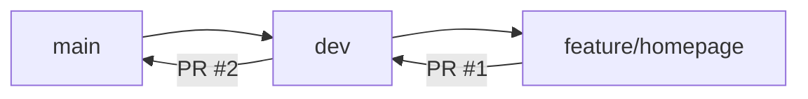

<div align="center">


# **Evolusi App**

<p align="center">
  <strong>Aplikasi Web Modern & CI/CD Pipeline — Praktikum Konstruksi dan Evolusi Perangkat Lunak</strong>
</p>

<p align="center">
  
  
  
  
  
  
</p>

<p align="center">
  <a href="#-tentang-proyek">Tentang</a> •
  <a href="#-fitur-utama">Fitur</a> •
  <a href="#-tech-stack">Tech Stack</a> •
  <a href="#-instalasi">Instalasi</a> •
  <a href="#-struktur-proyek">Struktur</a> •
  <a href="#-workflow-git">Workflow</a> •
  <a href="#-author">Author</a>
</p>

</div>

---

## 📖 Tentang Proyek

**Evolusi App** adalah aplikasi web modern yang mengintegrasikan backend **Laravel** dan frontend **Vue 3 SPA (Single Page Application)** sebagai pemenuhan praktikum mata kuliah **Konstruksi dan Evolusi Perangkat Lunak**. Proyek ini dilengkapi dengan arsitektur RESTful API, pengujian otomatis terisolasi (PHPUnit & Vitest), serta pipeline CI/CD bertingkat menggunakan GitHub Actions dengan mekanisme *artifact passing* dan *branch protection*.

<div align="center">

| Detail | Informasi |
|--------|-----------|
| **Mata Kuliah** | Konstruksi dan Evolusi Perangkat Lunak |
| **Program Studi** | Software Engineering |
| **Repository** | `evolusi-pl-24-536179-SV-24400` |
| **Framework & Tools** | Laravel, Vue 3, Vite, Vitest, GitHub Actions |
| **Status** | 🟢 CI/CD Automated & Active Development |

</div>

---

## ✨ Fitur Utama

| Fitur | Deskripsi |
|-------|-----------|
| 🔐 **Authentication System** | Login, Register, Email Verification, Password Reset dengan Laravel Breeze |
| 📱 **Responsive Design** | Mobile-first approach, optimal di semua ukuran layar |
| 🎨 **Modern UI/UX** | Custom design dengan TailwindCSS, dark mode support |
| 🗄️ **Database & Migrations** | Eloquent ORM, migrasi terstruktur, seeder & factory |
| ⚡ **Performance** | Route caching, config caching, optimized asset loading |
| 🔒 **Security** | CSRF protection, XSS prevention, SQL injection protection |
| 🧪 **Testing** | Feature & Unit tests dengan PHPUnit |
| 🚀 **CI/CD Ready** | GitHub Actions workflow untuk testing otomatis |

---

## 🛠 Tech Stack

<div align="center">

### Backend


### Frontend (SPA)


### Testing & CI/CD


</div>

---

## 🚀 Instalasi & Menjalankan Proyek

### Prasyarat
- PHP ≥ 8.2 & Composer
- Node.js ≥ 20 & NPM
- SQLite / MySQL

### 1. Setup Backend (Laravel)

```bash
# Clone repository
git clone https://github.com/KEPL2026/evolusi-pl-24-536179-SV-24400.git
cd evolusi-pl-24-536179-SV-24400

# Install dependencies PHP
composer install

# Environment setup
cp .env.example .env
php artisan key:generate

# Migrasi & Seeder
php artisan migrate --seed

# Jalankan backend server
php artisan serve
# Backend aktif di http://localhost:8000
```

### 2. Setup Frontend (Vue 3 SPA)

```bash
# Masuk ke direktori frontend
cd frontend

# Install dependencies Node.js
npm install

# Setup environment frontend
cp .env.example .env
# Default VITE_API_URL=http://localhost:8000/api

# Jalankan unit test (Vitest)
npm run test

# Jalankan development server
npm run dev
# Frontend aktif di http://localhost:5173
```

---

## 📁 Struktur Proyek

```
evolusi-pl-24-536179-SV-24400/
├── .github/
│   └── workflows/
│       ├── ci.yml                 # Laravel CI/CD Workflow
│       └── frontend.yml           # Frontend 4-Stage CI/CD (Lint -> Test -> Build -> Deploy)
├── app/
│   ├── Http/Controllers/Api/     # RESTful API Controller (TugasController)
│   └── Models/                    # Eloquent Models (Tugas, User)
├── config/cors.php                # Konfigurasi CORS untuk integrasi Frontend Vue
├── database/migrations/           # Skema database & tabel tugas
├── routes/
│   ├── api.php                    # RESTful JSON API Routes
│   └── web.php                    # Web routes
├── frontend/                      # Vue 3 SPA Application
│   ├── src/
│   │   ├── views/                 # HomeView.vue, TugasView.vue
│   │   ├── router/                # Vue Router Configuration
│   │   └── utils/                 # Pure helper logic & Vitest unit tests
│   ├── vite.config.js             # Konfigurasi Vite & Vitest
│   ├── package.json               # Dependensi Vue 3, Vite, Vitest, ESLint
│   └── .env.example               # Referensi VITE_API_URL
├── tests/                         # PHPUnit Feature & Unit Tests
├── composer.json                  # Dependensi Laravel
└── README.md
```

---

## 🌿 Workflow Git

Proyek ini mengikuti alur **Git Flow** sederhana dengan **Branch Protection**:



### Branch Strategy

| Branch | Tujuan | Protection |
|--------|--------|------------|
| `main` | Production-ready code | ✅ Required PR, Status Checks |
| `dev` | Integration branch | ✅ Required PR, Status Checks |
| `feature/*` | Feature development | ❌ No direct push to main/dev |

### Pull Request Flow

1. **PR #1**: `feature/homepage` → `dev`
   - Review kode, jalankan test
   - Merge setelah approved & CI hijau

2. **PR #2**: `dev` → `main`
   - Final review sebelum release
   - Tag version setelah merge

### Conventional Commits

Semua commit mengikuti format:
```
<type>(<scope>): <description>

Types: feat, fix, docs, style, refactor, test, chore
```

Contoh:
```bash
feat: add custom homepage design
fix: resolve mobile navigation issue
docs: update README with installation guide
test: add feature tests for authentication
chore: update dependencies
```

---

## ⚙️ GitHub Actions Workflow

File workflow: `.github/workflows/ci.yml`

```yaml
name: Laravel CI

on:
  push:
    branches: [main, dev]
  pull_request:
    branches: [main, dev]

jobs:
  test:
    runs-on: ubuntu-latest
    steps:
      - uses: actions/checkout@v4
      - name: Setup PHP
        uses: shivammathur/setup-php@v2
        with:
          php-version: '8.2'
      - name: Install Dependencies
        run: composer install --no-interaction --prefer-dist
      - name: Generate Key
        run: php artisan key:generate --force
      - name: Run Tests
        run: php artisan test --no-coverage
```

**Status**: 

---

## 📋 Checklist Tugas & Praktikum

- [x] Repository bernama `evolusi-pl-24-536179-SV-24400`
- [x] Aplikasi Laravel 11 / 13 (Backend API & CORS)
- [x] Aplikasi Frontend Vue 3 SPA (Vite + Vue Router)
- [x] Pengujian Logika Unit Terisolasi (Vitest & PHPUnit)
- [x] Minimal 5 commit (Conventional Commits)
- [x] Branching strategy: `main`, `dev`, `feature/homepage`, `feature/p4-frontend-vue`
- [x] GitHub Actions workflow:
  - `.github/workflows/ci.yml` (Laravel Testing)
  - `.github/workflows/frontend.yml` (4-Stage: Lint -> Test -> Build -> Deploy with Artifact Passing)
- [x] Workflow berjalan **GREEN/SUCCESS**
- [x] Branch protection pada `main` & `dev`
- [x] Collaborator dosen/asisten (role: Read)
- [x] Tidak ada file sensitif (`.env`, key, secret)
- [x] README informatif & terstruktur
- [x] `.gitignore` lengkap

---

## 📄 License

Proyek ini dilisensikan di bawah **MIT License** - lihat file [LICENSE](LICENSE) untuk detail.

> **Note**: Ini adalah proyek tugas akademik praktikum. Kode bersifat edukatif.

---

## 👨‍💻 Author

<div align="center">

| | |
|---|---|
| **Nama** | Matthew Hayunaji Priantara |
| **NIM** | 24/536179/SV/24400 |
| **Program Studi** | Software Engineering |
| **Mata Kuliah** | Konstruksi dan Evolusi Perangkat Lunak |
| **Semester** | 5 |

[](https://github.com/matthewpriantara)
[](https://linkedin.com/in/matthewpriantara)

</div>

---

<div align="center">

**⭐ Jika proyek ini bermanfaat, beri star ya!**

Made with ❤️ using Laravel & Vue 3

</div>